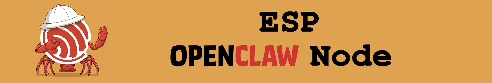
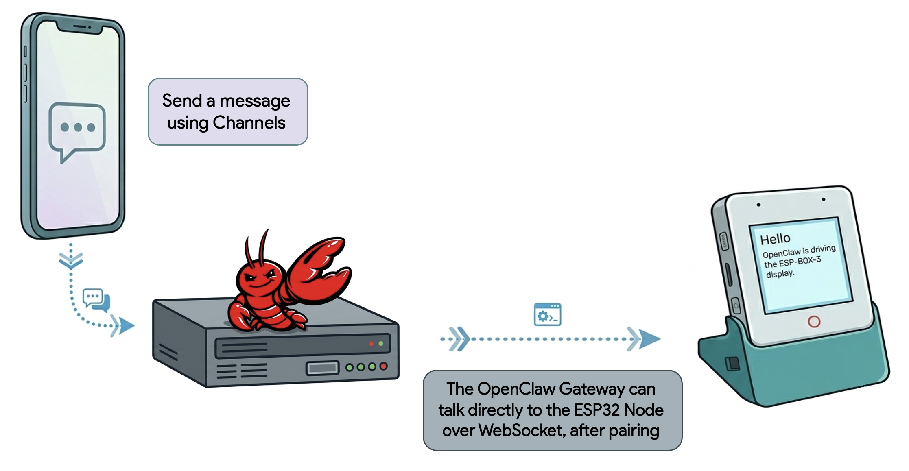

# esp-mochi-node

This repository contains the `esp-mochi-node` ESP-IDF component, example applications, and documentation for running ESP32 boards as [Mochi Nodes](https://docs.mochi.ai/nodes).

## Repository Layout

- `components/esp-mochi-node/`: The `esp-mochi-node` ESP-IDF component that handles Mochi transport, pairing, reconnect, and command dispatch.  
See the [Component README](./components/esp-mochi-node/README.md) for more details on component internals.
- `examples/`: Example applications for supported boards.
- `docs/`: Getting-started and troubleshooting guides.

## Start Here

1. Read [Getting Started](./docs/getting-started.md).
2. Choose an example from [Examples](./examples/README.md).
3. Use [Troubleshooting](./docs/troubleshooting.md) if the node pairs, connects, or advertises commands differently than expected.
